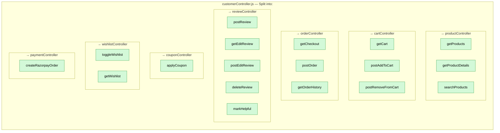
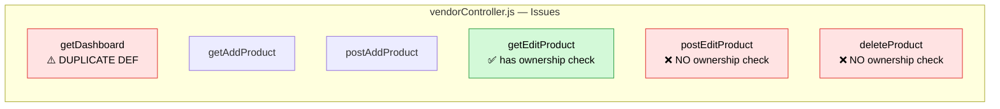
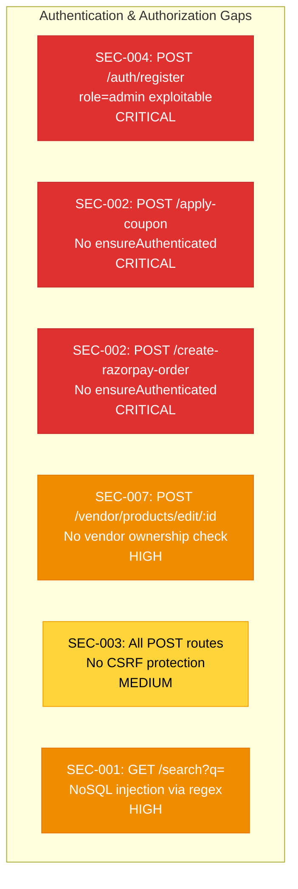
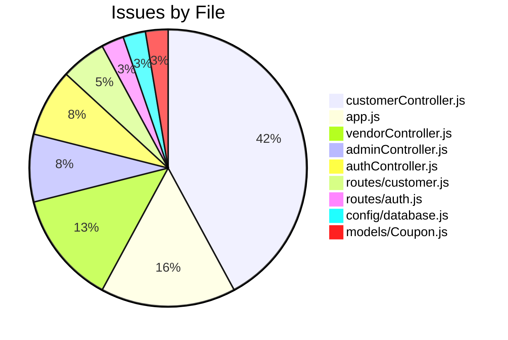

# GRAPHIFY_GRAPH — Multi-Vendor Marketplace

## Architecture Relationship Graph

```mermaid
graph TB
    %% === LAYER STYLING ===
    classDef entry fill:#ff6b6b,stroke:#c92a2a,color:#fff,font-weight:bold
    classDef config fill:#ffd43b,stroke:#f59f00,color:#000
    classDef route fill:#69db7c,stroke:#2f9e44,color:#000
    classDef middleware fill:#74c0fc,stroke:#1c7ed6,color:#000
    classDef controller fill:#da77f2,stroke:#9c36b5,color:#fff
    classDef model fill:#ffa94d,stroke:#e67700,color:#000
    classDef hotspot stroke:#e03131,stroke-width:4px,color:#e03131

    %% === ENTRY ===
    app["🌐 app.js<br/>Entry Point<br/>Express + Session + Passport"]
    class app entry,hotspot

    %% === CONFIG ===
    db["🗄️ config/database.js<br/>Mongoose Connect<br/>⚠️ Deprecated options"]
    passport["🔑 config/passport.js<br/>LocalStrategy<br/>serialize/deserialize"]
    class db config
    class passport config

    %% === MIDDLEWARE ===
    authMW["🛡️ middleware/authMiddleware.js<br/>ensureAuthenticated<br/>isAdmin · isVendor"]
    class authMW middleware

    %% === ROUTES ===
    rAuth["🔗 routes/auth.js<br/>GET/POST register<br/>GET/POST login · logout"]
    rAdmin["🔗 routes/admin.js<br/>/dashboard · /users<br/>/products"]
    rVendor["🔗 routes/vendor.js<br/>/dashboard<br/>/products/add · edit · delete"]
    rCustomer["🔗 routes/customer.js<br/>/ · /search · /cart<br/>/checkout · /orders · /reviews"]
    class rAuth route
    class rAdmin route
    class rVendor route
    class rCustomer route,hotspot

    %% === CONTROLLERS ===
    cAuth["👤 controllers/authController.js<br/>getRegister · postRegister<br/>getLogin · postLogin · logout"]
    cAdmin["👔 controllers/adminController.js<br/>getDashboard · getUsers<br/>getProducts · delete*"]
    cVendor["🏪 controllers/vendorController.js<br/>getDashboard ⚠️ DUPLICATE<br/>add · edit · delete product"]
    cCustomer["🛒 controllers/customerController.js<br/>20+ exports — GOD OBJECT<br/>Products · Cart · Orders · Reviews<br/>Wishlist · Coupons · Razorpay"]
    class cAuth controller
    class cAdmin controller,hotspot
    class cVendor controller,hotspot
    class cCustomer controller,hotspot

    %% === MODELS ===
    mUser["👤 models/User.js<br/>username · email · password<br/>role · shopName · wishlist"]
    mProduct["📦 models/Product.js<br/>name · price · category<br/>stock · image · vendor"]
    mOrder["📋 models/Order.js<br/>customer · products[] · totalAmount<br/>status · shippingAddress"]
    mReview["⭐ models/Review.js<br/>product · user · rating<br/>comment · helpfulUsers"]
    mCoupon["🎫 models/Coupon.js<br/>code · discount<br/>expiryDate · isActive"]
    class mUser model
    class mProduct model
    class mOrder model
    class mReview model
    class mCoupon model

    %% === ROUTE MOUNTS (app.js → routes) ===
    app -->|"/auth"| rAuth
    app -->|"/admin"| rAdmin
    app -->|"/vendor"| rVendor
    app -->|"/"| rCustomer

    %% === CONFIG IMPORTS ===
    app -->|"require"| db
    app -->|"require"| passport
    passport -->|"User.findOne"| mUser

    %% === ROUTE → CONTROLLER ===
    rAuth --> cAuth
    rAdmin --> cAdmin
    rAdmin -->|"guard"| authMW
    rVendor --> cVendor
    rVendor -->|"guard"| authMW
    rCustomer --> cCustomer
    rCustomer -->|"guard"| authMW

    %% === CONTROLLER → MODEL ===
    cAuth -->|"findOne · save"| mUser
    cAdmin -->|"find · delete"| mUser
    cAdmin -->|"find · delete"| mProduct
    cVendor -->|"find · save · delete"| mProduct
    cCustomer -->|"find · findById"| mProduct
    cCustomer -->|"find · save"| mOrder
    cCustomer -->|"find · create · update"| mReview
    cCustomer -->|"findById · save"| mUser
    cCustomer -->|"findOne"| mCoupon

    %% === HOTSPOT ANNOTATIONS ===
    linkStyle 12 stroke:#e03131,stroke-width:3px
    linkStyle 13 stroke:#e03131,stroke-width:3px
```

## Hotspot Detail Views

### 🔴 Hotspot #1: customerController.js (16 hits)

### 🔴 Hotspot #2: vendorController.js (5 hits)

### 🔴 Hotspot #3: Auth Gaps (cross-cutting)

## Issue Distribution by File

